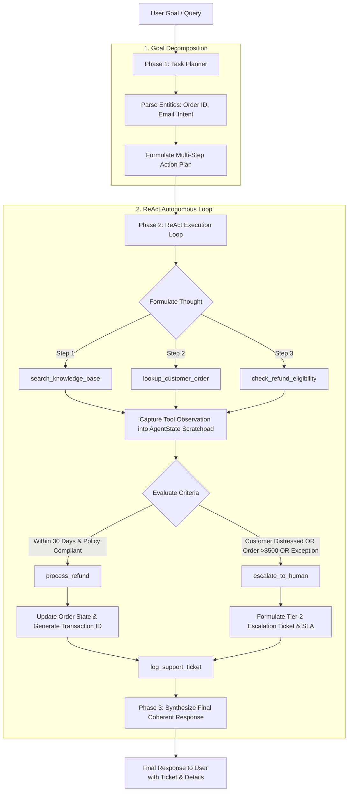

# Autonomous Customer Support & Escalation Agent
### Techvruk AI Agentic System Contest Submission

[](https://www.python.org/downloads/)
[](#system-architecture--workflow-diagram)
[](#testing--verification)
[](#running-the-project)
[](LICENSE)

An enterprise-grade, autonomous AI Agentic System built to demonstrate the core principles of agentic behavior: **reasoning, multi-step planning, tool execution, and continuous state context**.

Rather than relying on brittle, single-call prompt-response LLMs, this system implements an explicit **ReAct (Reasoning + Acting)** state machine that deconstructs customer inquiries into ordered subtasks, coordinates **6 specialized tools** against live mock data, validates business policy rules (e.g. 30-day return windows), and dynamically activates a **Tier-2 Human Escalation Protocol** when edge cases or high customer distress are detected.

---

## 📌 Problem & Task Chosen

### Task: Autonomous Customer Support & Escalation Agent
Traditional customer support chatbots are notoriously brittle:
1. **One-shot Hallucinations:** LLM-only bots output polite yet fabricated policy answers without querying true database records.
2. **Rigid Decision Trees:** Pre-programmed IVR and rule-based bots trap users in repetitive loops when their query contains multi-part intents.
3. **No Execution Capability:** They cannot inspect order delivery dates, calculate date differences, or trigger refund transactions.
4. **Failure to Detect Risk:** They fail to escalate when an order has high financial exposure (>$500) or when a customer expresses legal threats or severe distress.

### Agentic Solution
This system replaces static bots with an autonomous **ReAct Agent**:
- **Goal Deconstruction:** Given an incoming message, the agent plans the sequence of actions required.
- **Grounded Tool Calling:** It searches the official knowledge base (`search_knowledge_base`), retrieves customer order records (`lookup_customer_order`), and computes policy eligibility (`check_refund_eligibility`).
- **Autonomous Execution:** If an order qualifies within policy (e.g., 30-day window), it autonomously issues a refund transaction (`process_refund`) and records a CRM ticket (`log_support_ticket`).
- **Context-Preserving Escalation:** If the query exhibits high urgency, angry sentiment, high value loss, or a policy exception, it activates the **Tier-2 Human Escalation Protocol** (`escalate_to_human`), generating an incident packet with target SLA without losing any dialogue history.

---

## 🏗️ System Architecture & Workflow Diagram

The system adheres strictly to the **Plan → Act → Observe → Respond** agentic cycle:



### State Management (`AgentState`)
Every interaction is backed by a typed Pydantic state model (`AgentState`):
- `session_id`: Unique identifier for the conversation session.
- `plan`: Ordered list of `PlanStep` items with dynamic progress tracking (`pending`, `in_progress`, `completed`).
- `scratchpad`: Sequential history of `AgentAction` entries containing `Thought`, `Action Name`, `Action Input`, and `Observation`.
- `escalation`: Structured `EscalationDetail` tracking `urgency`, `sentiment`, `ticket_id`, and `sla_minutes`.
- `final_response`: Complete, empathetic synthesized customer response.

---

## 🛠️ Autonomous Tool Registry

| Tool Name | Input Parameters | Output / Action |
|:---|:---|:---|
| `search_knowledge_base` | `query: str`, `category: str (optional)` | BM25 ranked policy documentation (Returns, Damages, Shipping, Warranty, Escalation). |
| `lookup_customer_order` | `order_id: str`, `email: str` | Customer tier, order telemetry, tracking number, items, carrier, and delivery date. |
| `check_refund_eligibility` | `order_id: str`, `reason: str` | Date math verifying delivery date against the 30-day policy window and condition rules. |
| `process_refund` | `order_id: str`, `amount: float`, `reason: str` | Executes financial transaction, credits payment method, logs `TXN-REF` ID. |
| `escalate_to_human` | `customer_name: str`, `email: str`, `issue_summary: str`, `urgency: str`, `sentiment: str` | Triggers Tier-2 support protocol, assigns SLA (<15 mins), outputs `ESC-` ticket. |
| `log_support_ticket` | `customer_name: str`, `email: str`, `category: str`, `description: str`, `resolution_status: str` | Persists interaction into CRM database (`data/tickets.json`). |

---

## 💻 Setup & Run Instructions

### 1. Prerequisites
- Python 3.10, 3.11, 3.12, 3.13, or 3.14
- Git

### 2. Installation
Clone the repository:
```bash
git clone https://github.com/Anandha-raaman/Chatbot-Techvruk.git
cd Chatbot-Techvruk

# Install dependencies
pip install -r requirements.txt
```

### 3. API Key Configuration (Optional — Zero-Key Offline Ready!)
In accordance with contest fairness rules, **this agent runs out-of-the-box in offline mode with zero API keys required**. 

If you wish to test with Google Gemini's live API:
```bash
# Create .env file
echo GEMINI_API_KEY=your_gemini_api_key_here > .env
```

### 4. Running the Project

#### Option A: Interactive Streamlit Web UI (Recommended)
Launch the interactive web dashboard with live reasoning tree and 1-click test scenarios:
```bash
streamlit run app.py
```
*Open your browser to `http://localhost:8501`.*

#### Option B: Interactive CLI Mode
Run in your terminal with colored telemetry:
```bash
python main.py --cli
```

#### Option C: Automated Benchmark Demo
Run all 4 contest benchmark scenarios sequentially:
```bash
python main.py
```

#### Option D: Execute Test Suite
Verify all unit and integration test assertions:
```bash
python -m unittest test_agent.py
```

---

## 📋 Sample Input & Output Traces

### Scenario 1: Knowledge Base Policy Inquiry
- **User Query:**  
  `"What is your standard return and refund policy for retail goods?"`
- **Plan Generated:**  
  1. Analyze query intent → 2. Search knowledge base (`search_knowledge_base`) → 3. Log interaction (`log_support_ticket`) → 4. Synthesize response.
- **Agent Observation:** Retrieved article `KB-001: Standard 30-Day Return & Refund Policy`.
- **Final Agent Output:**
  > **📋 Standard 30-Day Return & Refund Policy**  
  > Customers can initiate a return within 30 calendar days of delivery for all standard retail items. The item must be in its original packaging, unopened, or gently inspected with all accessories included. Once received at our warehouse, a full refund to the original payment method will be credited within 3-5 business days. Return shipping fees are free for defective items and $4.99 for remorse returns. *(Policy Reference: `KB-001`)*

---

### Scenario 2: Real-time Order & Delivery Tracking
- **User Query:**  
  `"Can you check the tracking status of my order ORD-89421?"`
- **Plan Generated:**  
  1. Extract Order ID `ORD-89421` → 2. Query database (`lookup_customer_order`) → 3. Synthesize tracking details.
- **Agent Observation:** Order `ORD-89421` found for Sarah Jenkins (Gold Tier). Delivered September 16, 2026 via FedEx Ground (`TRK-FEDEX-998124`).
- **Final Agent Output:**
  > **📦 Order & Shipping Details**  
  > Here is the real-time telemetry for **Order `ORD-89421`**:  
  > - **Current Status:** `Delivered`  
  > - **Carrier:** FedEx Ground (Tracking: `TRK-FEDEX-998124`)  
  > - **Order Date:** 2026-09-12 | **Delivery Date:** 2026-09-16  
  > - **Items:** Wireless Noise-Cancelling Headphones (x1)  
  > - **Total Amount:** $179.99

---

### Scenario 3: Autonomous Refund Processing (Within 30-Day Window)
- **User Query:**  
  `"I received order ORD-89421 on September 16, but the headphones have severe distortion. Please refund my payment."`
- **ReAct Execution Trace:**
  - *Thought 1:* Check KB for damaged/defective goods policy.  
    *Action:* `search_knowledge_base(query="defective headphones refund")`  
    *Observation:* Matches `KB-002` (Immediate refund/replacement authorized).
  - *Thought 2:* Lookup order telemetry for `ORD-89421`.  
    *Action:* `lookup_customer_order(order_id="ORD-89421")`  
    *Observation:* Order confirmed delivered 2026-09-16. Total $179.99.
  - *Thought 3:* Calculate date difference against 30-day window.  
    *Action:* `check_refund_eligibility(order_id="ORD-89421")`  
    *Observation:* Delivered 9 days ago. Within 30-day window. Eligible!
  - *Thought 4:* Process refund transaction.  
    *Action:* `process_refund(order_id="ORD-89421", amount=179.99)`  
    *Observation:* Transaction `TXN-REF-B4A198` executed.
- **Final Agent Output:**
  > **✅ Refund Successfully Processed**  
  > Good news! We have processed your refund request autonomously in accordance with our **30-Day Return & Refund Policy (KB-001)**.  
  > - **Order ID:** `ORD-89421`  
  > - **Refund Amount:** **$179.99**  
  > - **Payment Method Credited:** Credit Card (Visa ending in 4242)  
  > - **Transaction Reference:** `TXN-REF-B4A198`  
  > - **Estimated Credit Time:** 3-5 business days

---

### Scenario 4: Critical Human Escalation Protocol
- **User Query:**  
  `"This is UNACCEPTABLE! My order ORD-90214 was over $640, it is severely delayed, and your carrier won't respond. Escalate this to a human manager immediately or I contact my attorney!"`
- **ReAct Execution Trace:**
  - *Thought 1:* Analyze sentiment and urgency. Detected `angry` sentiment, `critical` urgency, and order value >$500.
  - *Thought 2:* Lookup order `ORD-90214`. Status is `In Transit - Delayed`. Amount is `$649.00`.
  - *Thought 3:* Trigger Tier-2 Human Escalation per Protocol `KB-006`.  
    *Action:* `escalate_to_human(customer_name="Elena Rostova", email="elena.rostova@example.com", urgency="critical", sentiment="angry")`  
    *Observation:* Incident ticket `ESC-20260925-D318A9` created. SLA target: 10 minutes.
- **Final Agent Output:**
  > **🛡️ Priority Support Escalation Notice**  
  > Dear Elena Rostova,  
  > I have reviewed your inquiry regarding Order **ORD-90214**. Because your situation involves a high-value delayed shipment and requires senior investigation, I have formally escalated your case directly to our **Tier-2 Human Specialist**.  
  > - **Incident Ticket ID:** `ESC-20260925-D318A9`  
  > - **Priority Level:** `CRITICAL`  
  > - **Target Response SLA:** Under **10 minutes**  
  > - **Assigned Team:** Priority Incident Resolution Team  
  > A Senior Support Specialist is already reviewing the full dialogue transcript and courier trace telemetry.

---

## 🧪 Testing & Verification

The project includes an automated test suite verifying all core functionalities:
```bash
python -m unittest test_agent.py -v
```

### Test Output:
```text
test_01_knowledge_base_search (__main__.TestTechvrukAgent) ... ok
test_02_order_lookup (__main__.TestTechvrukAgent) ... ok
test_03_refund_eligibility_within_30_days (__main__.TestTechvrukAgent) ... ok
test_04_refund_eligibility_past_30_days (__main__.TestTechvrukAgent) ... ok
test_05_agent_react_loop_refund_flow (__main__.TestTechvrukAgent) ... ok
test_06_agent_human_escalation_protocol (__main__.TestTechvrukAgent) ... ok

----------------------------------------------------------------------
Ran 6 tests in 0.071s

OK
```

---

## 📊 Presentation Deliverable

As required by the contest rules (*Short presentation — max 5 slides*), the slide deck is provided in two formats:
1. **PowerPoint Presentation:** `Techvruk_Agentic_System_Presentation.pptx` (Generated automatically via `generate_pptx.py`).
2. **Speaker Notes & Markdown Deck:** [`presentation.md`](presentation.md) (Slide-by-slide script, timing, and talking points).

---

## ⚖️ Contest Guidelines & Free-Tier Compliance

- **No Paid APIs:** Fully functional offline simulator engine ensures zero dependencies on paid tokens.
- **Original Architecture:** Custom Pydantic state machine with explicit ReAct tool loop developed specifically for this contest.
- **Deterministic Action Logs:** Complete audit trail in `data/tickets.json` and `data/customers.json`.
