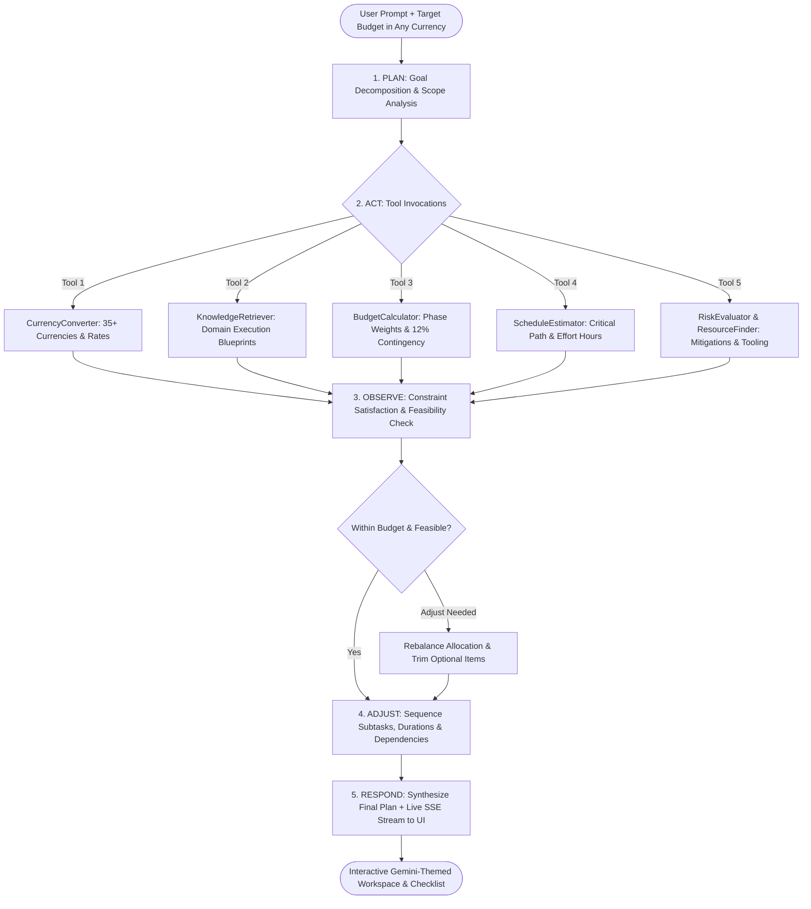

# ✦ Chatbot Techvruk - Autonomous Task Planner Agent
### Autonomous Multi-Currency AI Agent for Dynamic Task & Project Orchestration

[](https://www.python.org/)
[](https://flask.palletsprojects.com/)
[](https://chatbot-techvruk.vercel.app/)
[](https://github.com/Anandha-raaman/Chatbot-Techvruk)
[](https://opensource.org/licenses/MIT)

---

## 🌐 Live Deployment & Demo Walkthrough

| Resource | Link | Description |
| :--- | :--- | :--- |
| 🚀 **Live Deployed Web App** | **[chatbot-techvruk.vercel.app](https://chatbot-techvruk.vercel.app/)** | Production application deployed on **Vercel** with full interactive Gemini UI |
| 📽️ **Demo Video Walkthrough** | **[Google Drive Video Recording](https://drive.google.com/file/d/1et9eNJhL7IshKhn02RfaxsCkgChwers4/view?usp=sharing)** | Full end-to-end video recording demonstrating agent reasoning, tool calls, and plan generation |
| 💻 **GitHub Repository** | **[Anandha-raaman/Chatbot-Techvruk](https://github.com/Anandha-raaman/Chatbot-Techvruk)** | Open-source codebase, architecture documentation, and test suites |

> 💡 *Full end-to-end demonstration featuring goal decomposition, 35+ global currency handling, autonomous ReAct tool calls (`CurrencyConverter`, `BudgetCalculator`, etc.), real-time SSE thought traces, interactive task checklist, and markdown/JSON export.*

---

## 1. Problem Statement & Task Chosen

### The Challenge
Most conventional LLM chatbots operate as **one-shot prompt-response engines**: when a user asks to plan a complex objective (e.g., *"Plan a 5-day cultural trip to Tokyo with ¥250,000 JPY"* or *"Build and launch an AI SaaS MVP with $3,500 USD"*), traditional models generate superficial bullet points without verified financial allocations, dependency tracking, currency exchange calculations, or constraint optimization.

### Our Solution: General Task Planner Agent
We built a general-purpose, autonomous **Task Planner Agent** that can deconstruct **ANY arbitrary goal** (travel, software engineering, conference organizing, digital marketing, home renovation, study/prep roadmaps, business launches, etc.).

Crucially, our system solves two core challenges:
1. **Domain Generalization**: The agent is not hardcoded to a single task; it dynamically classifies domains, retrieves contextual execution blueprints, and constructs granular, milestone-driven phases.
2. **Arbitrary Currency & Financial Feasibility**: Users specify a budget in **any world currency** (e.g., `USD $`, `EUR €`, `INR ₹`, `GBP £`, `JPY ¥`, `CAD C$`, `AUD A$`, `AED`, `CHF`, `SGD`, etc.). The agent autonomously normalizes currencies, calculates phased budget allocations, locks in an emergency contingency reserve (10–15%), evaluates feasibility, and ensures every subtask has an assigned price tag in the user's chosen currency with zero debt risk.

---

## 2. Agentic Workflow Behaviour

The system strictly follows the **ReAct (Reasoning + Acting)** and **Plan-and-Execute** paradigms rather than a single prompt-response:

$$\text{User Goal} \longrightarrow [\textbf{PLAN}] \longrightarrow [\textbf{ACT: Tools}] \longrightarrow [\textbf{OBSERVE}] \longrightarrow [\textbf{ADJUST}] \longrightarrow [\textbf{RESPOND}]$$



### The 5 Agentic Stages
1. **PLAN**: Deconstructs high-level intent, detects domain patterns, and extracts budget/currency parameters.
2. **ACT (Tools Execution)**:
   - `currency_converter`: Validates rates and purchasing power across 35+ global currencies.
   - `knowledge_retriever`: Fetches domain best practices, milestone sequences, and risk vectors.
   - `budget_calculator`: Mathematically allocates funds, sets a mandatory 12% contingency reserve, and checks feasibility.
   - `schedule_estimator`: Computes active working days, total effort hours, and critical paths.
   - `risk_evaluator` & `resource_finder`: Maps dependencies, software licenses, equipment, and mitigations.
3. **OBSERVE**: Analyzes tool outputs, validates constraints against user caps, and calculates the Feasibility Score (0–100).
4. **ADJUST**: Sequences dependencies (`T01 -> T02 -> T03`), tags priorities, and adjusts line items to prevent budget overruns.
5. **RESPOND**: Delivers a structured plan with interactive checklists, financial bars, and export options.

---

## 3. System Architecture

```
Chatbot-Techvruk/
├── app.py                      # Flask Server, Server-Sent Events (SSE) Stream, REST APIs
├── agent/
│   ├── planner_agent.py        # Autonomous ReAct Orchestrator & State Management
│   ├── tools.py                # 6 Agentic Tools (Currency, Budget, Schedule, Risk, Resources, Blueprint)
│   └── schemas.py              # Pydantic v2 Type-Safe Data Models
├── static/
│   ├── index.html              # Sleek Gemini UI (Hero, Pill Composer, Trace Drawer, Plan View)
│   ├── css/
│   │   └── style.css           # Premium Gemini Dark/Light Theme with Iridescent Accents
│   └── js/
│       └── app.js              # Reactive Client, SSE Stream Consumer, Task Checklist & Exports
├── test_agent.py               # Standalone Command-Line Automated Test Suite
├── requirements.txt            # Python Dependencies
├── PRESENTATION.md             # 5-Slide Presentation Summary
└── README.md                   # Complete Documentation & Benchmarks
```

---

## 4. Setup & Run Instructions

### Prerequisites
- Python 3.10 or higher
- Modern web browser (Chrome, Edge, Firefox, Safari)

### Quick Start (One Command)
1. **Clone the repository:**
   ```bash
   git clone https://github.com/Anandha-raaman/Chatbot-Techvruk.git
   cd Chatbot-Techvruk
   ```

2. **Install dependencies:**
   ```bash
   pip install -r requirements.txt
   ```

3. **Run the application:**
   ```bash
   python app.py
   ```

4. **Open in browser:**
   Navigate to [http://localhost:5000](http://localhost:5000).

> [!NOTE]
> The agent works **100% autonomously out of the box** using its built-in ReAct reasoning engine—no paid API keys required!
> If you have a Google Gemini API key, you can optionally paste it in the **Settings (⚙️)** modal to activate live Gemini Flash reasoning.

---

## 5. Sample Inputs & Outputs

### Example 1: Travel & Cultural Trip (Japanese Yen - JPY)
* **Goal Input:** `"Plan a 5-day cultural and culinary trip to Tokyo and Kyoto"`
* **Budget:** `¥250,000 JPY`
* **Currency:** `JPY (¥)`

#### Agentic Execution Trace:
```text
[PLAN]    Step 1: Goal Decomposition & Scope Analysis
          -> Domain classified as 'TRAVEL'. Target constraint: ¥250,000 JPY.
[ACT]     Step 2: Currency Normalization & Exchange Rate Audit
          -> Tool 'currency_converter': ¥250,000 JPY (~$1,621.27 USD).
[ACT]     Step 3: Domain Blueprint & Workflow Retrieval
          -> Tool 'knowledge_retriever': Loaded 3-phase travel blueprint.
[ACT]     Step 4: Multi-Currency Budget & Contingency Allocation
          -> Tool 'budget_calculator': Operational fund: ¥220,000 | 12% Contingency: ¥30,000.
[ACT]     Step 5: Resource Mapping & Risk Assessment
          -> Tool 'risk_evaluator_and_resource_finder': Identified transit delays, forex surcharges.
[OBSERVE] Step 6: Constraint Satisfaction & Feasibility Audit
          -> Within budget: TRUE | Feasibility Score: 95/100.
[ADJUST]  Step 7: Plan Optimization & Dependency Sequencing
          -> Formatted 9 subtasks with localized costs and tool chips.
[RESPOND] Step 8: Final Agent Response & Plan Delivery
```

#### Final Structured Output:
- **Phases:**
  1. *Phase 1: Pre-Departure Logistics & Bookings* (¥99,000 JPY)
     - `[T01]` Reserve Round-Trip Flight & City Center Lodging — `¥39,600 JPY` (Tools: Google Flights, Booking API)
     - `[T02]` Acquire Travel Insurance & International eSIM — `¥3,960 JPY` (Tools: Airalo eSIM, WorldNomads)
     - `[T03]` Compile Digital Documents & Visa Authorizations — `¥990 JPY`
  2. *Phase 2: Itinerary & Experience Orchestration* (¥88,000 JPY)
     - `[T04]` Map Key Neighborhoods & Cultural Sites — `¥13,200 JPY`
     - `[T05]` Book High-Demand Attractions & Museum Tickets — `¥10,560 JPY`
     - `[T06]` Curate Authentic Culinary & Hidden Gem Checklist — `¥13,200 JPY`
  3. *Phase 3: Departure Readiness & Contingency Protocol* (¥33,000 JPY)
     - `[T07]` Pack Climate-Appropriate Wardrobe & Power Adapters — `¥2,640 JPY`
     - `[T08]` Setup Zero-Forex Cards & Cash Buffer — `¥4,400 JPY`
     - `[T09]` Download Offline Maps & Language Packs — `¥0 JPY`
- **Contingency Reserve:** `¥30,000 JPY`
- **Total Feasible Cost:** `¥250,000 JPY`

---

### Example 2: Tech Event Organizing (Indian Rupee - INR)
* **Goal Input:** `"Organize a 200-person Regional Tech Conference with keynotes and sponsor booths"`
* **Budget:** `₹4,50,000 INR`
* **Currency:** `INR (₹)`
* **Output:**
  - *Phase 1 (Venue & Financial Lock):* ₹1,98,000 INR (Auditorium, AV systems, registration portal)
  - *Phase 2 (Speaker & Vendor Management):* ₹1,38,600 INR (Catering, badges, speaker kit)
  - *Phase 3 (Rehearsal & Live Run):* ₹59,400 INR (Stage crew, dry runs, session recording)
  - *Contingency Buffer:* ₹54,000 INR
  - *Feasibility Index:* 95/100

---

## 6. Key Features & Contest Rubric Alignment

| Rubric Criteria | Implementation in Project |
| :--- | :--- |
| **Agentic Workflow** | Transparent ReAct sequence (`Plan -> Act -> Observe -> Adjust -> Respond`) streamed live to UI via SSE. |
| **Multi-Step Tool Use** | 6 specialized tools: `CurrencyConverter`, `BudgetCalculator`, `ScheduleEstimator`, `RiskEvaluator`, `ResourceFinder`, `KnowledgeRetriever`. |
| **Multi-Currency Support** | Users can supply budgets in 35+ currencies (USD, EUR, INR, GBP, JPY, CAD, AUD, etc.); the agent formats and verifies costs in the user's currency. |
| **User Interface** | Google Gemini aesthetic with floating pill composer, real-time agent trace accordion, interactive subtask checkboxes, dark/light theme, and export options. |
| **Export Formats** | One-click copy/download as Markdown (`.md`), structured JSON (`.json`), or printer-friendly document. |
| **Follow-up Interaction** | Interactive chat allowing users to request budget reductions, timeline accelerations, or risk mitigations dynamically. |
| **Deployed Web Application** | **[Live on Vercel](https://chatbot-techvruk.vercel.app/)** — instant cloud deployment with full interactive Gemini UI. |
| **Demo Video & Walkthrough** | [Google Drive Demo Recording](https://drive.google.com/file/d/1et9eNJhL7IshKhn02RfaxsCkgChwers4/view?usp=sharing) showing full UI, agent execution traces, and exports. |

---

## 7. License
Distributed under the MIT License. See `LICENSE` for details.
