# Universal Autonomous Task Planner Agent
### Techvruk AI Agentic System Contest Submission

[](https://www.python.org/downloads/)
[](#system-architecture--workflow-diagram)
[](#testing--verification)
[](#running-the-project)
[](#problem-statement--universal-scope)
[](LICENSE)

An enterprise-grade, universal AI Agentic System built to demonstrate the core principles of agentic behavior: **reasoning, multi-step planning, tool execution, and continuous state context** for **ANY arbitrary task or goal**.

Directly fulfilling the official contest task requirement:
> **"Task Planner Agent: Given a goal (e.g., 'plan a 3-day trip'), break it into sub-tasks and generate a structured plan."**

Rather than being limited to hardcoded blueprints, this system operates as a **Universal Task Planner**: whether given a travel goal, software sprint, exam study plan, hackathon event, or apartment renovation, it dynamically parses intent, audits workload feasibility, deconstructs the objective into phased subtasks with dependency tags, computes critical path schedules, assesses operational risks, and exports an actionable master roadmap with a unique Plan ID (`PLAN-2026-...`).

Wrapped in an **ultra-smooth Red & White Gemini-inspired user interface**.

---

## 📌 Problem Statement & Universal Scope

### The Failure of One-Shot Prompting
When a user asks a conventional LLM to plan a project (e.g. *"Plan a 3-day trip to Tokyo on a $1,200 budget"* or *"Build an AI SaaS MVP in 4 weeks"*):
1. **Unstructured Paragraph Dumps:** Standard chatbots output walls of generic text lacking dates, milestones, or explicit deliverables.
2. **Zero Constraint Verification:** They fail to verify whether financial budgets or timeframes realistically support the activities.
3. **No Dependency Awareness:** They schedule downstream activities before prerequisites are met (e.g., attempting site tours before airport transfer or lodging check-in).
4. **Rigid Static Templates:** Hardcoded bots break when the user enters an unexpected or non-standard goal.

### The Universal Agentic Solution
This system is completely domain-agnostic and handles **ANY task**:
- **Goal Intent & Constraint Extraction:** Autonomously infers action verbs, domain category, timeline constraints (days/weeks/months), budget ceilings, and complexity.
- **Feasibility & Workload Auditing:** Evaluates effort hours, workload intensity, and provides scoping recommendations.
- **Dynamic Phased Decomposition:** Partitions ANY goal into 4 chronological stages:
  1. *Phase 1: Inception, Scoping & Prerequisites*
  2. *Phase 2: Core Execution & Implementation*
  3. *Phase 3: Validation, Quality Review & Testing*
  4. *Phase 4: Launch, Delivery & Handover*
- **Critical Path & Milestones:** Identifies the bottleneck dependency chain and establishes milestone progress gates.
- **Failure Mode Safeguards:** Pairs each identified operational risk with an automated contingency protocol.
- **Plan Persistence:** Archives the structured plan into persistent memory (`data/plans.json`).

---

## 🏗️ System Architecture & Workflow Diagram

The agent adheres strictly to the **Plan → Act → Observe → Respond** agentic cycle:

```mermaid
flowchart TD
    A[User Goal: ANY Task or Goal Input] --> B[Phase 1: Task Intent & Constraint Parsing]
    
    subgraph Parsing [1. Goal Decomposition]
        B --> B1[Extract Goal Verb & Topic]
        B1 --> B2[Extract Timeline & Budget Limits]
        B2 --> B3[Determine Complexity Tier]
    end
    
    B3 --> C[Phase 2: ReAct Autonomous Execution Loop]
    
    subgraph ReActLoop [2. ReAct Execution Loop]
        C --> D1{Thought 1}
        D1 --> T1[analyze_task_intent]
        T1 --> O1[Observe Domain Category & Constraints]
        
        O1 --> D2{Thought 2}
        D2 --> T2[audit_feasibility_and_effort]
        T2 --> O2[Observe Feasibility Score & Workload Hours]
        
        O2 --> D3{Thought 3}
        D3 --> T3[decompose_any_task]
        T3 --> O3[Observe 4-Phase Subtasks & Deliverables]
        
        O3 --> D4{Thought 4}
        D4 --> T4[derive_critical_path_and_milestones]
        T4 --> O4[Observe Critical Path & 3 Progress Gates]
        
        O4 --> D5{Thought 5}
        D5 --> T5[audit_failure_modes_and_safeguards]
        T5 --> O5[Observe Risk Matrix & Mitigations]
        
        O5 --> D6{Thought 6}
        D6 --> T6[persist_master_plan]
        T6 --> O6[Observe Plan ID: PLAN-2026-...]
    end
    
    O6 --> F[Phase 3: Synthesize Final Master Execution Plan]
    F --> G[Deliver Master Plan: Tasks, Milestones, Risks, Effort]
```



### State Management (`AgentState`)
Every interaction is backed by a typed Pydantic state model (`AgentState`):
- `session_id`: Unique identifier for the conversation session.
- `user_goal`: Raw goal prompt provided by the user.
- `parsed_constraints`: Dictionary holding duration (days), budget ceiling, domain category, and complexity tier.
- `scratchpad`: Sequential list of `AgentAction` objects recording `Thought`, `Action Name`, `Action Input`, and `Observation`.
- `structured_plan`: Complete `StructuredPlan` object containing subtasks, critical path, milestones, and risks.
- `final_response`: Executive Markdown presentation roadmap.

---

## 🛠️ Autonomous Tool Registry

| Tool Name | Input Parameters | Output / Action |
|:---|:---|:---|
| `analyze_task_intent` | `goal: str` | Extracts goal intent, domain category, duration constraints, budget, and complexity. |
| `audit_feasibility_and_effort` | `goal: str`, `timeline_days: int`, `complexity: str`, `budget: float` | Computes workload hours, feasibility score (0–100), warnings, and scope advice. |
| `decompose_any_task` | `goal: str`, `category: str`, `complexity: str`, `timeline_days: int` | Universally breaks down ANY task into 4 phased, chronological deliverables. |
| `derive_critical_path_and_milestones` | `subtasks: list`, `timeline_days: int` | Maps dependency chains, derives the sequential critical path, and establishes 3 milestone checkpoints. |
| `audit_failure_modes_and_safeguards` | `goal: str`, `category: str` | Audits operational failure points and injects concrete contingency protocols. |
| `persist_master_plan` | `plan_data: dict` | Persists the final structured plan into `data/plans.json` with a unique Plan ID. |

---

## 💻 Setup & Run Instructions

### 1. Prerequisites
- Python 3.10, 3.11, 3.12, 3.13, or 3.14
- Git

### 2. Installation
Clone the repository:
```bash
git clone https://github.com/Anandha-raaman/Chatbot-Techvruk.git
cd Chatbot-Techvruk

# Install dependencies
pip install -r requirements.txt
```

### 3. API Key Configuration (Optional — Zero-Key Offline Ready!)
In accordance with contest fairness rules, **this agent runs out-of-the-box in offline mode with zero API keys required**. 

If you wish to test with Google Gemini's live API:
```bash
# Create .env file
echo GEMINI_API_KEY=your_gemini_api_key_here > .env
```

### 4. Running the Project

#### Option A: Interactive Streamlit Web UI (Gemini Red & White Theme)
Launch the web dashboard featuring prompt chips, live reasoning tree, and real-time ReAct telemetry:
```bash
python main.py --web
```
*Open your browser to `http://localhost:8501`.*

#### Option B: Interactive CLI Mode
Run in your terminal with colored telemetry:
```bash
python main.py --cli
```

#### Option C: Automated Benchmark Demo
Run 4 automated multi-domain planning scenarios sequentially:
```bash
python main.py
```

#### Option D: Execute Test Suite
Verify all unit and integration test assertions:
```bash
python -m unittest test_agent.py
```

---

## 📋 Multi-Domain Benchmark Scenarios

### Benchmark 1: 3-Day Trip to Tokyo (Contest Prompt Example)
- **Goal:** `"Plan a 3-day cultural and culinary trip to Tokyo for 2 people with historic landmarks and food markets on a $1,200 budget"`
- **Decomposed Phases:**
  - *Phase 1 (Logistics):* Flight confirmation, central hotel booking, local eSIM data, and IC transit card pre-orders.
  - *Phase 2 (Itinerary):* Day 1 arrival & neighborhood walk; Day 2 Asakusa & culinary food tour; Day 3 Meiji Shrine & market shopping.
  - *Phase 3 (Departure):* Souvenir packing, hotel checkout, and return transit transfer.
- **Critical Path:** `TASK-01 ➔ TASK-03 ➔ TASK-04 ➔ TASK-05`
- **Risks & Safeguards:** Advance reservation of landmark passes + open-date museum backup vouchers for rain.

### Benchmark 2: SaaS AI MVP Launch in 4 Weeks
- **Goal:** `"Build and launch a SaaS AI MVP in 4 weeks with user authentication and payment billing on a $2,000 budget"`
- **Decomposed Phases:**
  - *Phase 1:* PRD specification, database schema design, and CI/CD repository setup.
  - *Phase 2:* Backend service endpoints, Stripe payment webhooks, and responsive frontend UI.
  - *Phase 3:* End-to-end integration testing, input guardrails, and telemetry logging.
  - *Phase 4:* Cloud deployment with custom SSL domain, beta onboarding, and feedback triage.

### Benchmark 3: Exam Preparation Sprint
- **Goal:** `"Prepare for the AWS Solutions Architect exam in 30 days studying 2 hours daily with hands-on practice labs"`
- **Decomposed Phases:**
  - *Phase 1:* Syllabus scoping, official documentation curation, and benchmark diagnostic test.
  - *Phase 2:* High-priority service deep-dives (Compute, Storage, Networking, IAM).
  - *Phase 3:* Hands-on architecture labs and timed mock exams.
  - *Phase 4:* Final weak-area revision, formula cheatsheets, and exam day logistics.

---

## 🧪 Testing & Verification

The project includes an automated test suite verifying all core functionalities:
```bash
python -m unittest test_agent.py -v
```

### Test Output:
```text
test_01_analyze_task_intent (__main__.TestUniversalTaskPlanner) ... ok
test_02_audit_feasibility (__main__.TestUniversalTaskPlanner) ... ok
test_03_decompose_arbitrary_task (__main__.TestUniversalTaskPlanner) ... ok
test_04_critical_path_and_milestones (__main__.TestUniversalTaskPlanner) ... ok
test_05_risk_safeguards (__main__.TestUniversalTaskPlanner) ... ok
test_06_end_to_end_universal_planning (__main__.TestUniversalTaskPlanner) ... ok

----------------------------------------------------------------------
Ran 6 tests in 0.025s

OK
```

---

## 📊 Presentation Deliverable

As required by the contest rules (*Short presentation — max 5 slides*), the slide deck is provided in two formats:
1. **PowerPoint Presentation:** `Techvruk_Agentic_System_Presentation.pptx` (Generated automatically with executive Red & White aesthetic).
2. **Speaker Notes & Markdown Deck:** [`presentation.md`](presentation.md) (Slide-by-slide script, timing, and talking points).

---

## ⚖️ Contest Guidelines & Free-Tier Compliance

- **No Paid APIs Required:** Built-in offline simulator engine ensures zero dependencies on paid tokens.
- **Original Architecture:** Custom Pydantic state machine with explicit ReAct tool loop developed specifically for this contest.
- **Deterministic Action Logs:** Complete audit trail in `data/plans.json`.
