# Autonomous Task Planner Agent
### Techvruk AI Agentic System Contest Submission

[](https://www.python.org/downloads/)
[](#system-architecture--workflow-diagram)
[](#testing--verification)
[](#running-the-project)
[](LICENSE)

An enterprise-grade, autonomous AI Agentic System built to demonstrate the core principles of agentic behavior: **reasoning, multi-step planning, tool execution, and continuous state context**.

Directly fulfilling the official contest task requirement:
> **"Task Planner Agent: Given a goal (e.g., 'plan a 3-day trip'), break it into sub-tasks and generate a structured plan."**

Rather than generating generic one-shot paragraphs, this system implements an explicit **ReAct (Reasoning + Acting)** state machine that parses constraints, decomposes objectives into phase-aligned subtasks with dependency tags, tests feasibility against domain blueprints, determines the critical path schedule, assesses operational risks, and exports an actionable master roadmap with a unique Plan ID (`PLAN-2026-...`).

---

## 📌 Problem & Task Chosen

### The Challenge of Complex Goals
When a human or organization presents a high-level goal (e.g. *"Plan a 3-day trip to Tokyo on a $1,200 budget"* or *"Build and launch an AI MVP in 4 weeks"*), traditional LLMs fall short:
1. **Unstructured Prose Dumps:** Standard chatbots output walls of generic text lacking dates, milestones, or explicit deliverables.
2. **Zero Constraint Verification:** They fail to verify whether financial budgets ($1,200) or timeframes (3 days) realistically support the activities.
3. **No Dependency Awareness:** They schedule downstream activities before prerequisites are met (e.g., attempting site tours before airport transfer or lodging check-in).
4. **No Risk Safeguards:** They ignore weather disruptions, booking lead times, and operational bottlenecks.

### The Agentic Solution
This system operates as an **Autonomous Task Planner Agent**:
- **Constraint Parsing:** Extracts temporal boundaries, budget ceilings, and domain types.
- **Blueprint Matching:** Queries historical blueprints (`data/planner_blueprints.json`) to establish standard execution phases.
- **Feasibility Auditing:** Evaluates scope against duration and resources with numerical scoring (0–100).
- **Sub-task Decomposition:** Constructs numbered subtasks (`TASK-01`, `TASK-02`) with estimated hours, priority ratings, and dependency links.
- **Critical Path Derivation:** Computes the bottleneck chain that dictates project completion.
- **Risk Mitigation Matrix:** Injects contingency safeguards for identified operational failure modes.
- **Plan Persistence:** Archives the structured plan into persistent storage (`data/plans.json`).

---

## 🏗️ System Architecture & Workflow Diagram

The agent adheres strictly to the **Plan → Act → Observe → Respond** agentic cycle:

```mermaid
flowchart TD
    A[User Goal: 'Plan a 3-day trip to Tokyo...'] --> B[Phase 1: Constraint Parser]
    
    subgraph Parsing [1. Constraint Extraction]
        B --> B1[Extract Duration: 3 Days]
        B1 --> B2[Extract Budget: $1,200.00]
        B2 --> B3[Classify Domain: trip_planning]
    end
    
    B3 --> C[Phase 2: ReAct Autonomous Execution Loop]
    
    subgraph ReActLoop [2. ReAct Execution Loop]
        C --> D1{Thought 1}
        D1 --> T1[search_domain_blueprints]
        T1 --> O1[Observe Blueprint Phases & Tasks]
        
        O1 --> D2{Thought 2}
        D2 --> T2[analyze_goal_feasibility]
        T2 --> O2[Observe Feasibility Score & Warnings]
        
        O2 --> D3{Thought 3}
        D3 --> T3[decompose_into_subtasks]
        T3 --> O3[Observe Ordered Subtasks & Deliverables]
        
        O3 --> D4{Thought 4}
        D4 --> T4[calculate_schedule_and_critical_path]
        T4 --> O4[Observe Critical Path & Milestones]
        
        O4 --> D5{Thought 5}
        D5 --> T5[assess_risks_and_mitigations]
        T5 --> O5[Observe Risk Matrix & Safeguards]
        
        O5 --> D6{Thought 6}
        D6 --> T6[export_structured_plan]
        T6 --> O6[Observe Plan ID: PLAN-2026-...]
    end
    
    O6 --> F[Phase 3: Synthesize Final Master Execution Plan]
    F --> G[Deliver Master Plan: Tasks, Critical Path, Budget, Risks]
```



### State Management (`AgentState`)
Every interaction is backed by a typed Pydantic state model (`AgentState`):
- `session_id`: Unique identifier for the conversation session.
- `user_goal`: Original raw prompt provided by the user.
- `parsed_constraints`: Dictionary holding duration (days), budget ceiling, and domain.
- `scratchpad`: Sequential list of `AgentAction` objects recording `Thought`, `Action Name`, `Action Input`, and `Observation`.
- `structured_plan`: Complete `StructuredPlan` object containing subtasks, critical path, risks, and budget breakdown.
- `final_response`: Executive Markdown presentation roadmap.

---

## 🛠️ Autonomous Tool Registry

| Tool Name | Input Parameters | Output / Action |
|:---|:---|:---|
| `search_domain_blueprints` | `domain_or_goal: str` | Retrieves domain templates, milestone phases, and typical task structures. |
| `analyze_goal_feasibility` | `goal: str`, `timeline_days: int`, `budget: float` | Computes feasibility score (0–100), warnings, and scope adjustments. |
| `decompose_into_subtasks` | `goal: str`, `domain: str`, `timeline_days: int` | Deconstructs goal into chronologically ordered subtasks with duration and deliverables. |
| `calculate_schedule_and_critical_path` | `subtasks: list`, `timeline_days: int` | Maps dependency chains, derives the critical path, and establishes milestone checkpoints. |
| `assess_risks_and_mitigations` | `goal: str`, `domain: str` | Audits operational failure points and injects concrete contingency protocols. |
| `export_structured_plan` | `plan_data: dict` | Persists the final structured plan into `data/plans.json` with a unique Plan ID. |

---

## 💻 Setup & Run Instructions

### 1. Prerequisites
- Python 3.10, 3.11, 3.12, 3.13, or 3.14
- Git

### 2. Installation
Clone the repository:
```bash
git clone https://github.com/Anandha-raaman/Chatbot-Techvruk.git
cd Chatbot-Techvruk

# Install dependencies
pip install -r requirements.txt
```

### 3. API Key Configuration (Optional — Zero-Key Offline Ready!)
In accordance with contest fairness rules, **this agent runs out-of-the-box in offline mode with zero API keys required**. 

If you wish to test with Google Gemini's live API:
```bash
# Create .env file
echo GEMINI_API_KEY=your_gemini_api_key_here > .env
```

### 4. Running the Project

#### Option A: Interactive Streamlit Web UI (Recommended)
Launch the interactive web dashboard with live reasoning tree and 1-click test scenarios:
```bash
python main.py --web
```
*Open your browser to `http://localhost:8501`.*

#### Option B: Interactive CLI Mode
Run in your terminal with colored telemetry:
```bash
python main.py --cli
```

#### Option C: Automated Benchmark Demo
Run all 4 contest benchmark scenarios sequentially:
```bash
python main.py
```

#### Option D: Execute Test Suite
Verify all unit and integration test assertions:
```bash
python -m unittest test_agent.py
```

---

## 📋 Sample Input & Output Traces

### Primary Benchmark: 3-Day Trip to Tokyo
- **User Goal:**  
  `"Plan a 3-day cultural and culinary trip to Tokyo for 2 people with historic landmarks and food markets on a $1,200 budget"`
- **ReAct Execution Trace:**
  - *Thought 1:* Query domain blueprints for `trip_planning`.  
    *Action:* `search_domain_blueprints(domain_or_goal="trip to Tokyo")`  
    *Observation:* Retrieved travel blueprint with 3 phases (Pre-Departure, Daily Itinerary, Departure Logistics).
  - *Thought 2:* Test feasibility for 3 days with $1,200 budget.  
    *Action:* `analyze_goal_feasibility(timeline_days=3, budget=1200.0)`  
    *Observation:* Feasibility Score: **90/100 (Highly Feasible)**.
  - *Thought 3:* Deconstruct goal into daily phased subtasks.  
    *Action:* `decompose_into_subtasks(timeline_days=3, domain="trip_planning")`  
    *Observation:* Generated 6 discrete subtasks (Logistics, Transit Cards, Day 1 Orientation, Day 2 Cultural Landmarks, Day 3 Markets, Return Checkout).
  - *Thought 4:* Derive critical sequential path.  
    *Action:* `calculate_schedule_and_critical_path(subtasks=..., timeline_days=3)`  
    *Observation:* Critical Path: `TASK-01 ➔ TASK-03 ➔ TASK-04 ➔ TASK-05`.
  - *Thought 5:* Assess weather and operational risks.  
    *Action:* `assess_risks_and_mitigations(domain="trip_planning")`  
    *Observation:* Flagged weather risks and landmark booking lead times with voucher mitigations.
  - *Thought 6:* Export master plan object.  
    *Action:* `export_structured_plan(...)`  
    *Observation:* Plan saved as `PLAN-20260925-B819E2`.

- **Final Structured Plan Output:**
  ```markdown
  ### 📋 Autonomous Master Execution Plan: `PLAN-20260925-B819E2`
  > **Primary Goal:** *"Plan a 3-day cultural and culinary trip to Tokyo for 2 people with historic landmarks and food markets on a $1,200 budget"*
  > **Domain:** `TRIP_PLANNING` | **Timeline:** **3 Days** | **Estimated Budget:** **$1,200.00**

  ### 🎯 Decomposed Sub-Task Roadmap
  #### 📍 Phase 1: Pre-Departure Logistics
  - **`TASK-01` 🔴 Finalize transit tickets, airport transfers & book central accommodations** (4 Hours)
    *Deliverable:* Confirmed booking vouchers & arrival itinerary
  - **`TASK-02` 🟡 Secure local eSIM/mobile data and pre-order regional transit passes** (1 Hour) *(Depends on `TASK-01`)*
    *Deliverable:* Active connectivity & digital transit cards

  #### 📍 Phase 2: Daily Itinerary Execution
  - **`TASK-03` 🔴 Day 1: Arrival, neighborhood orientation walk, and signature welcome dinner** (Full Day)
    *Deliverable:* Completed Day 1 experiential itinerary
  - **`TASK-04` 🔴 Day 2: Morning cultural heritage landmarks, afternoon museums & evening food tour** (Full Day)
    *Deliverable:* Completed Day 2 experiential itinerary
  - **`TASK-05` 🔴 Day 3: Scenic outdoor/nature exploration, artisan market shopping & farewell dinner** (Full Day)
    *Deliverable:* Completed Day 3 experiential itinerary

  #### 📍 Phase 3: Wrap-Up & Departure
  - **`TASK-06` 🟡 Pack souvenirs, settle lodging expenses & execute return transit transfer** (3 Hours)
    *Deliverable:* Smooth checkout and return departure

  ### ⚡ Critical Path & Milestone Schedule
  - **Critical Sequential Path:** `TASK-01 ➔ TASK-03 ➔ TASK-04 ➔ TASK-05`
  - **Milestone 1:** Logistics & Readiness verified before arrival.
  - **Milestone 2:** Midpoint cultural landmarks executed.
  - **Milestone 3:** Final checkout completed with zero budget overruns.

  ### 💰 Resource & Budget Allocation ($1,200.00)
  | Expense Category | Allocation % | Estimated Cost | Notes |
  |:---|:---:|:---:|:---|
  | Lodging | 35% | **$420.00** | Centrally located hotel |
  | Transportation | 25% | **$300.00** | Metro passes & transfers |
  | Dining | 20% | **$240.00** | Street food & culinary dinner |
  | Activities & Tickets | 12% | **$144.00** | Museum & landmark admissions |
  | Emergency Buffer | 8% | **$96.00** | Incidentals & contingencies |

  ### 🛡️ Risk Audit & Contingency Matrix
  | Identified Risk | Severity | Automated Mitigation Protocol |
  |:---|:---:|:---|
  | Inclement weather disrupting outdoor walking tours | `MEDIUM` | Schedule flexible museum/indoor passes with open-date vouchers. |
  | Sold-out tickets for major landmarks | `HIGH` | Reserve skip-the-line timed entry tickets at least 2 weeks in advance. |
  | Transit navigation confusion or delays | `LOW` | Pre-download offline transit maps and regional metro navigation apps. |
  ```

---

## 🧪 Testing & Verification

The project includes an automated test suite verifying all core functionalities:
```bash
python -m unittest test_agent.py -v
```

### Test Output:
```text
test_01_search_domain_blueprints (__main__.TestTaskPlannerAgent) ... ok
test_02_analyze_goal_feasibility (__main__.TestTaskPlannerAgent) ... ok
test_03_decompose_trip_planning_goal (__main__.TestTaskPlannerAgent) ... ok
test_04_critical_path_and_schedule (__main__.TestTaskPlannerAgent) ... ok
test_05_risk_assessment_and_mitigation (__main__.TestTaskPlannerAgent) ... ok
test_06_end_to_end_agentic_workflow_trip_plan (__main__.TestTaskPlannerAgent) ... ok

----------------------------------------------------------------------
Ran 6 tests in 0.007s

OK
```

---

## 📊 Presentation Deliverable

As required by the contest rules (*Short presentation — max 5 slides*), the slide deck is provided in two formats:
1. **PowerPoint Presentation:** `Techvruk_Agentic_System_Presentation.pptx` (Generated automatically via `generate_pptx.py`).
2. **Speaker Notes & Markdown Deck:** [`presentation.md`](presentation.md) (Slide-by-slide script, timing, and talking points).

---

## ⚖️ Contest Guidelines & Free-Tier Compliance

- **No Paid APIs:** Fully functional offline simulator engine ensures zero dependencies on paid tokens.
- **Original Architecture:** Custom Pydantic state machine with explicit ReAct tool loop developed specifically for this contest.
- **Deterministic Action Logs:** Complete audit trail in `data/plans.json`.
